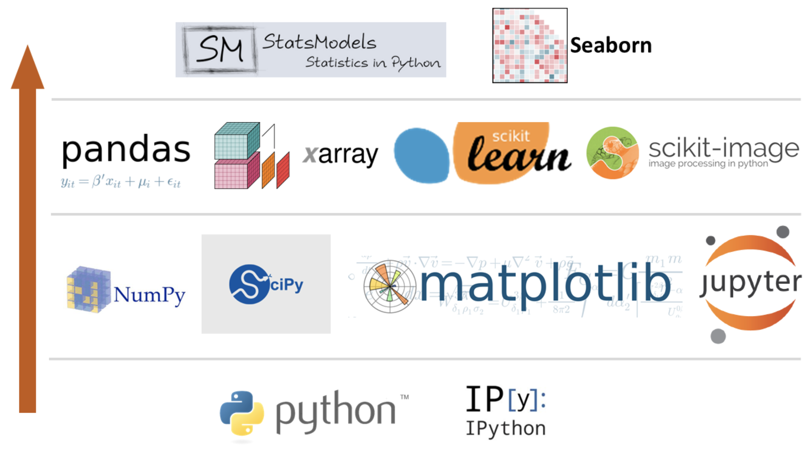
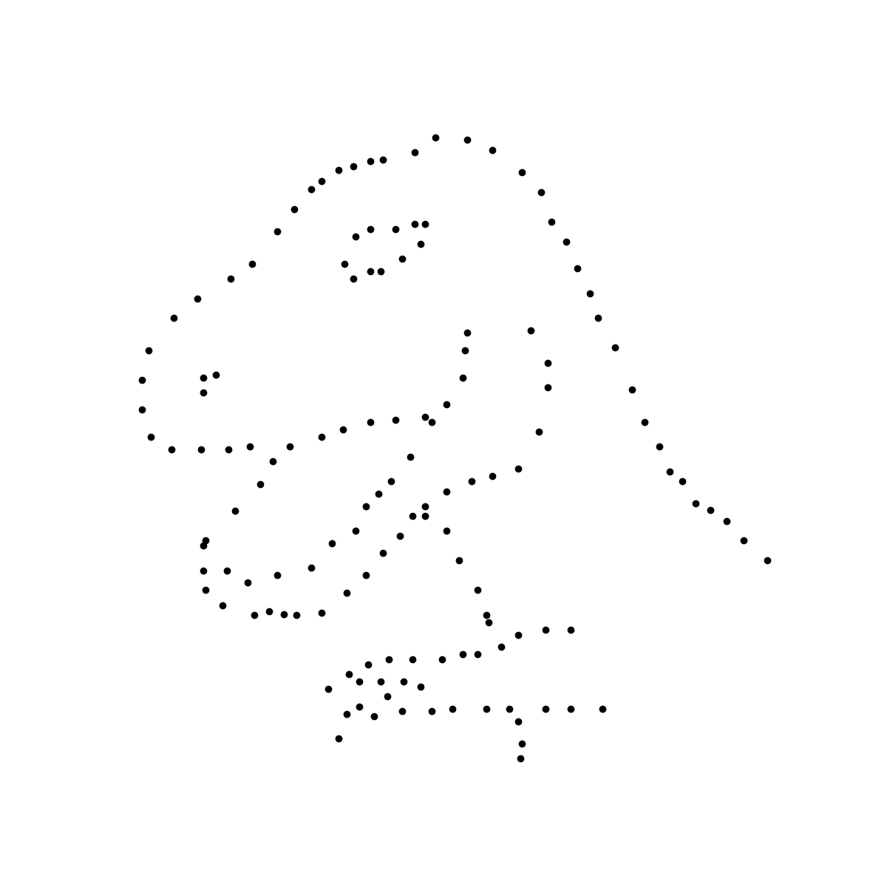

```{r child="setup.Rmd", echo=FALSE}
```
```{r xaringan-tile-view, echo=FALSE}
xaringanExtra::use_tile_view()
```
```{r xaringan-editable, echo=FALSE}
xaringanExtra::use_editable(expires=1)
```
```{r broadcast, echo=FALSE}
xaringanExtra::use_broadcast()
```
```{r xaringan-panelset, echo=FALSE}
xaringanExtra::use_panelset()
```
```{r xaringan-webcam, echo=FALSE}
xaringanExtra::use_webcam(width=300, height=225)
```
```{r xaringan-fit-screen, echo=FALSE}
xaringanExtra::use_fit_screen()
```

class: middle

# What are some important libraries for scientific computing?

---

There are many packages designed for data science with Python. Here are some of the most important ones:

```{r echo=FALSE, out.width="70%", fig.align="center"}

```

.center[.hand[Figure retrieved from [this website](https://cocalc.com/share/public_paths/741ad81231a9db8d8f83bf312458c606ddae7b1d).]]

---

.panelset[
.panel[.panel-name[**matplotlib**]
- `matplotlib` is the de facto data visualization package for Python
- Here are some [(official) cheatsheets](https://github.com/matplotlib/cheatsheets#cheatsheets)

```{r echo=FALSE, fig.align="center"}

```
]

.panel[.panel-name[**numpy**]
- `numpy` is a powerful array library that includes many numerical computing tools (e.g., vectorized operations, Fourier transforms)
- Here are [10 great numpy cheatsheets](https://blog.finxter.com/collection-10-best-numpy-cheat-sheets-every-python-coder-must-own/)

```{r echo=FALSE, fig.align="center"}
knitr::include_graphics("img/np_logo.png")
```
]

.panel[.panel-name[**pandas**]
- `pandas` is a data analysis and manipulation tool
- Official [pandas cheatsheet](https://pandas.pydata.org/Pandas_Cheat_Sheet.pdf)!

```{r echo=FALSE, fig.align="center"}
knitr::include_graphics("img/pandas_logo.png")
```
]

.panel[.panel-name[**jupyter notebook**]
- `jupyter` allows you to create documents that contain live code, equations, visualizations, and narrative text
- The [jupyter website](https://jupyter.org/)

```{r echo=FALSE, fig.align="center"}

```
]

]

---

class: middle

# Let's get started with **data science**!

```{python import-libraries}
import matplotlib.pyplot as plt
import numpy as np
import pandas as pd
```

---

class: middle

Let's use this data set for our discussion `r emo::ji('smile')`

```{python read-data}
df = pd.read_csv('data/cheese_and_deaths.csv')
df.head()
```

---

class: middle

.small[
.panelset[
.panel[.panel-name[Visualize Your Data]
```{python vis-data}
plt.figure(figsize=(5, 2.75))
plt.scatter(df['year'], df['deaths'])
plt.tight_layout()  # ensures things like axes labels aren't cut off
plt.show()          # don't forget this line!
```

Can we make this plot prettier `r emo::ji('thinking')`?
]

.panel[.panel-name[Add Axes Labels]
```{python vis-labels}
plt.figure(figsize=(5, 2.75))
plt.scatter(df['year'], df['deaths'])
plt.xlabel('Year')  #<<
plt.ylabel('Deaths')  #<<
plt.tight_layout()
plt.show()
```
]

.panel[.panel-name[Change Line Colour]
```{python vis-prettier-line}
plt.figure(figsize=(5, 2.75))
plt.scatter(df['year'], df['deaths'], color='black')  #<<
plt.xlabel('Year')
plt.ylabel('Deaths')
plt.tight_layout()
plt.show()
```

Our data seems to be linear... Let's use ordinary least squares to investigate `r emo::ji("coder")`!
]]

]

---

class: middle

.hand["Ordinary" least squares]

Ordinary least squares seeks to minimize the squared error between our line of best fit, $y = A + Bx$, and each of our datum $(x_i, y_i)$. After some [funky derivations](https://are.berkeley.edu/courses/EEP118/current/derive_ols.pdf), we arrive at

\begin{align*}
  \Delta(x) &= N \sum x^2 - (\sum x)^2 \\
  A(x, y) &= \frac{(\sum x^2 \sum y - \sum x \sum xy)}{\Delta} \\
  B(x, y) &= \frac{N \sum xy - \sum x \sum y}{\Delta}
\end{align*}

Let's create the functions $\Delta$, $A$, and $B$ together!

---

class: middle

.panelset[
.panel[.panel-name[Delta(x)]
.small[.hand[how do we create a function in Python?]]

\begin{equation*}
  \Delta(x) = N \sum x^2 - (\sum x)^2
\end{equation*}

.can-edit[
add code here!
]
]

.panel[.panel-name[A(x, y)]
.small[.hand[hint: use Delta (the function we just created)]]

\begin{equation*}
  A(x, y) = \frac{(\sum x^2 \sum y - \sum x \sum xy)}{\Delta}
\end{equation*}

.can-edit[
add code here
]
]

.panel[.panel-name[B(x, y)]
.small[.hand[Your turn!]]

\begin{equation*}
  B(x, y) = \frac{N \sum xy - \sum x \sum y}{\Delta}
\end{equation*}

.can-edit[
you add the code now :)
]

<br><br><br><br><br><br><br>
```{r echo=FALSE}
countdown(minutes = 1)
```

]
]

---

class: middle

.small[.hand[Let's add a line to our plot `r emo::ji('smile')`]]

```{python orig-fig}
plt.figure(figsize=(5, 2.75))
plt.scatter(df['year'], df['deaths'], color='black')
plt.xlabel('Year')
plt.ylabel('Deaths')
plt.tight_layout()
plt.show()
```

---

class: middle
.panelset[
.panel[.panel-name[Generate the line]
```{python, echo=F}
def Delta(x):
  return len(x) * np.sum(x**2) - (np.sum(x))**2

def A(x, y):
  return (np.sum(x**2)*np.sum(y) - np.sum(x)*np.sum(x*y)) / Delta(x)

def B(x, y):
  return (len(x)*np.sum(x*y) - np.sum(x)*np.sum(y)) / Delta(x)
```

.small[
```{python line}
intercept = A(df['year'], df['deaths'])
slope = B(df['year'], df['deaths'])
x = np.linspace(min(df['year']), max(df['year']), len(df['year']))
y = intercept + slope*x
```
]]

.panel[.panel-name[Plot the line]
.small[
```{python with-line}
plt.figure(figsize=(5, 2.75))
plt.plot(x, y) #<<
plt.scatter(df['year'], df['deaths'], color='black')
plt.xlabel('Year')
plt.ylabel('Deaths')
plt.tight_layout()
plt.show()
```
]]

]

---

class: middle

.your-turn[
Using the same dataset (`df`),
1. Plot `year` on the x-axis and `cheese_consumption` on the y-axis.
2. Colour the points red.
3. Include a regression line on your plot!
]
<br><br><br>

```{r echo=FALSE}
countdown(minutes = 2)
```

---

class: middle

.pull-left-narrow[
.hand[Let's draw a dinosaur!]

```{r echo=FALSE}

```
]

.pull-right-wide[
.hand[Here are your tasks:]
1. Download [data_dino.csv (click me)](./data_dino.csv).
2. Read `data_dino.csv` into Python.
3. Attempt to plot a dinosaur!
4. (bonus) Hide the axes labels.

**Hint:** The previous slides might come in handy.
]

```{r echo=FALSE}
countdown(minutes = 2)
```

---

class: middle

.pull-left-wide[
.hand[hopefully you've got a hang of it!]

```{python, eval=F}
path = 'data/data_dino.csv'
dino_df = pd.read_csv(path)
plt.figure(figsize=(4, 4))
plt.scatter(dino_df['horizontal'],
  dino_df['vertical'],
  color='black')
plt.axis('off')
plt.show()
```

]

.pull-right-narrow[
.hand[this is what it's supposed to look like]

```{r echo=FALSE, fig.align="center"}

```
]

---

.hand[make sure to visualize your data!]

```{r echo=FALSE}
knitr::include_graphics("img/DinoSequential.gif")
```

.hand[the Datasaurus Dozen: click [here](https://www.autodesk.com/research/publications/same-stats-different-graphs) for the original publication]

---

.hand[discussion: what have we learned so far?]

.can-edit[
-
]

---

.hand[Thanks for coming out to the workshop `r emo::ji('smile')`]
